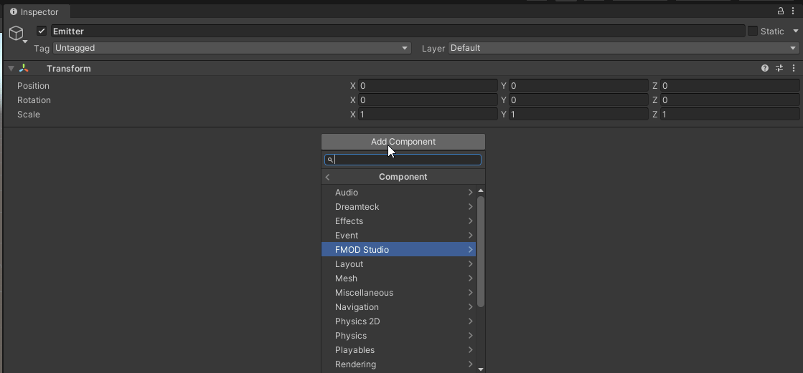
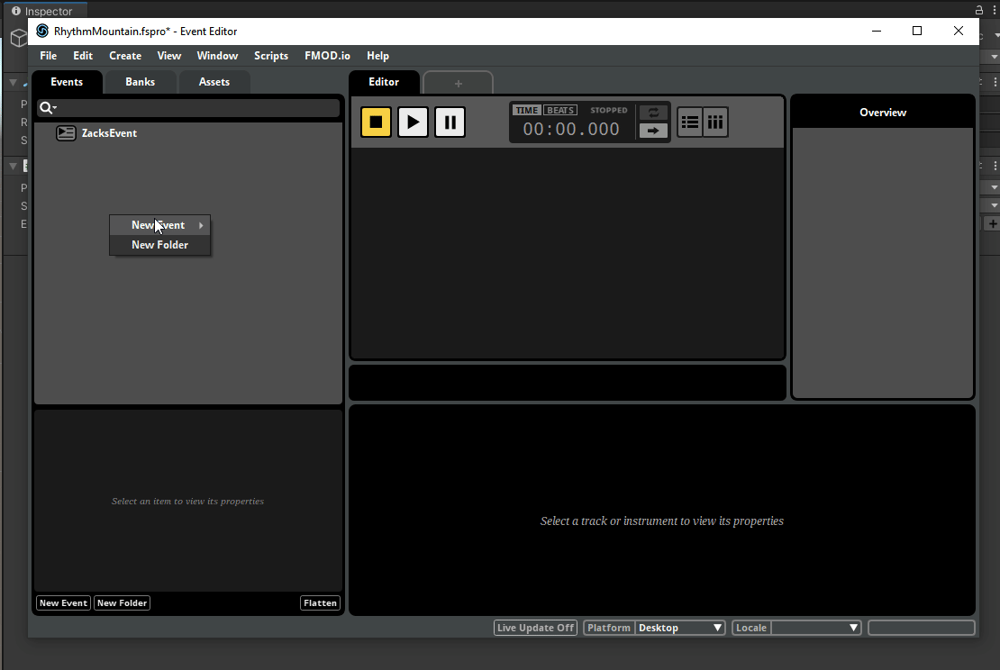

# FMOD
This project uses FMOD for the audio system.  
We are currently using `FMOD Studio Suite` version `2.02.04`.  
[Download here](https://www.fmod.com/download#fmodstudiosuite).

**Do not** use `AudioSource` or `AudioListener` since the unity audio system has been completely disabled.

The FMOD project lives at `Assets/../FMOD/RhythmMountain/RhythmMountain.fspro` (it lives outside the project).

> If you add events inside FMOD make sure to build them using F7 or they will not appear in Unity.
> Also, events only appear in unity if they are assigned to a bank so make sure they are assigned before you compile.

## Creating Events
Events can be created using the `FMOD Studio Event Emitter` script by hitting the `+` button.  
After creation it will appear inside FMOD automatically and can then be edited.  
This allows us to define events before we have the audio and then an audio engineer can fill in the details as needed inside FMOD.

### Create an event from inside Unity

### Create an event from inside FMOD
